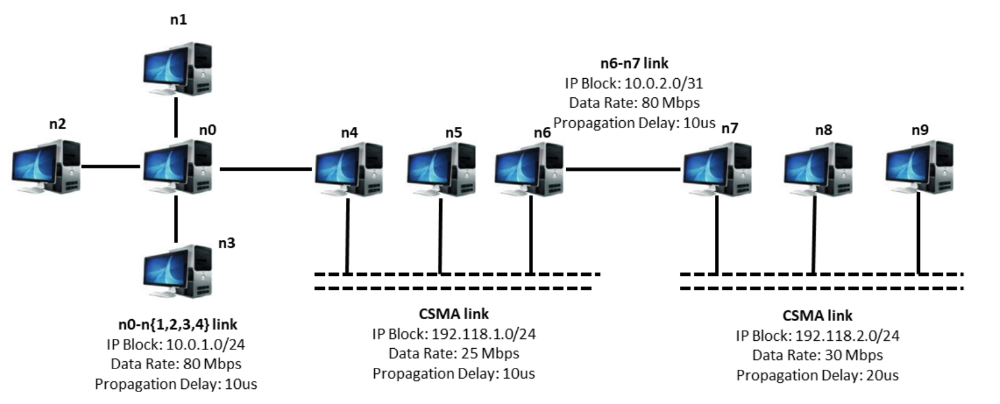

The goal of this tasks is to gain familiarity with the ns-3 working environment, along with Wireshark, and the simulation workflow.

## Simulation 1

Simulate the following network:

Regarding the details of the upper layers of the network, is required to create three different configurations that can be dynamically set via the command line using a parameter called "configuration," which is an integer that can only take one of the following values: 0, 1, 2.

Simulation time: **20 seconds for each run**. For all configurations enable PCAP packet tracing only on nodes n0, n5, and n7 and enable ASCII tracing only on the clients and servers.

- **Specifications for configuration 0**:
  - TCP Sink on node n1, port 2600
  - TCP OnOff Client on node n9.
    - Start data transmission: 3 seconds
    - End data transmission: 15 seconds
    - Packet size: 1500 bytes
- **Specifications for configuration 1**:
  - TCP Sink on:
    - n1, port 2600
    - n2, port 7777
  - TCP OnOff Client on node n9 sending data to n1:
    - Start data transmission: 5 seconds
    - End data transmission: 15 seconds
    - Packet size: 2500 bytes
  - TCP OnOff Client on node n8 sending data to n2:
    - Start data transmission: 2 seconds
    - End data transmission: 9 seconds
    - Packet size: 5000 bytes
      
- **Specifications for configuration 2**:
  - UDP Echo Server on node n2, port 63
  - UDP Echo Client on node n8:
    - Send 5 packets at 3s, 4s, 7s, 9s
    - Text to be sent: sum of your student IDs as a string
    - Packet size: 2560 bytes
  - TCP Sink on node n1, port 2600
  - UDP Sink on node n3, port 2500
  - TCP OnOff Client on node n9:
    - Start data transmission: 3s
    - End data transmission: 9s
    - Packet size: 3000 bytes
  - UDP OnOff Client on node n8:
    - Start data transmission: 5s
    - End data transmission: 15s
    - Packet size: 3000 bytes
